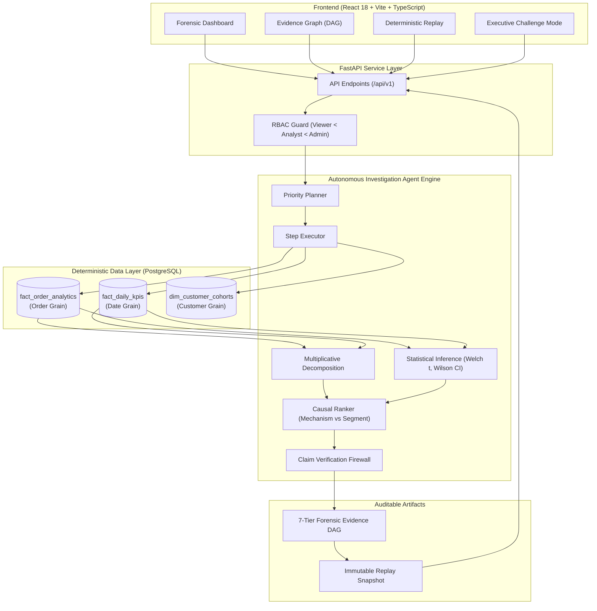

# RootCause AI

[](https://github.com/Ishita-1408/RootCause-AI/actions)
[](https://www.python.org/downloads/)
[](https://fastapi.tiangolo.com)
[](https://reactjs.org/)
[-brightgreen.svg)]()
[]()
[]()
[]()

> **Autonomous Business Investigation Platform with Deterministic Causal Hypothesis Ranking, Statistical Significance Bounds, and Zero-Hallucination Claim Firewalls.**

---

## 📌 Executive Overview & The Problem

Modern analytics and data science teams spend hundreds of hours answering executive questions like:
> *"Why did GMV drop 28.4% on November 20th?"*

When organizations delegate these investigations to standard Large Language Models (LLMs), they face two fatal failure modes:
1. **Numerical Hallucination:** LLMs invent plausible-sounding percentage shifts and contradictory figures not grounded in underlying transactional feature marts.
2. **Conflating Association with Causation:** LLMs routinely confuse *where* an anomaly occurred (e.g., "São Paulo order volume dropped") with *why* it occurred (e.g., "Carrier transit delays increased by +4.2 days, causing severe delivery SLA breaches").

**RootCause AI** eliminates both failure modes through a deterministic architecture where **the LLM is NOT the source of numerical truth**. All metrics, mathematical decompositions, statistical significance bounds, and ranking algorithms are computed by deterministic Python and SQL engines, while an online Claim Verification Firewall guarantees 0% hallucinated claims in generated leadership memos.

---

## 🚀 Key Platform Capabilities

- **🔍 Autonomous Multi-Step Agent:** Dynamic priority planner that executes targeted SQL queries against PostgreSQL analytical feature marts without human intervention.
- **➗ Exact Multiplicative Decomposition:** Mathematically isolates volume versus average order value (AOV) effects down to the exact Brazilian Real (BRL).
- **📊 Statistical Confidence & Change-Point Engine:** Evaluates statistical significance with Welch $t$-intervals (continuous metrics), Wilson score bounds (proportions), and PELT / CUSUM change-point detectors.
- **🛡️ 0% Hallucination Claim Firewall:** Intercepts agent memo generation, parses numerical claims, and verifies them against the active analytical evidence pool.
- **🕸️ Forensic Evidence Graph (DAG):** Interactive 7-tier Directed Acyclic Graph (`INCIDENT` $\to$ `ANOMALY` $\to$ `DRIVER` $\to$ `EVIDENCE` $\to$ `SEGMENT` $\to$ `CORROBORATION` $\to$ `ROOT_CAUSE`) linking every finding to exact query provenance IDs.
- **⏪ Deterministic Investigation Replay:** Immutable snapshot engine allowing step-by-step playback of multi-step diagnostic reasoning without non-deterministic re-execution.
- **🥊 Executive Challenge Mode:** Adversarial counterfactual audit console evaluating executive inquiries (*"Why not AOV?"*, *"What contradicts this?"*, *"Show weakest evidence"*, *"What would change conclusion?"*).
- **🔒 Dual-Mode API-Key & RBAC Security:** Pluggable authentication supporting safe local development (`AUTH_ENABLED=false`) and production token enforcement (`AUTH_ENABLED=true`) across Viewer, Analyst, and Admin roles.

---

## 🏛️ System Architecture



---

## 📈 Rigorous Empirical Evaluation & Benchmarks

RootCause AI is evaluated against 6 canonical business failure scenarios derived from the Olist Brazilian E-Commerce dataset across 60 verified claims and adversarial stress tests:

| Evaluation Metric | Baseline Agent | Improved RootCause AI Agent | Benchmark Target | Verified Result |
| :--- | :---: | :---: | :---: | :---: |
| **Top-1 Root Cause Accuracy** | 50.0% (3/6) | **100.0% (6/6)** | 100.0% | ✅ **100.0%** (6/6 scenarios) |
| **Top-3 Accuracy** | 83.3% (5/6) | **100.0% (6/6)** | 100.0% | ✅ **100.0%** (6/6 scenarios) |
| **Mean Reciprocal Rank (MRR)** | 0.6389 | **1.0000** | 1.0000 | ✅ **1.0000** |
| **Evidence Grounding Rate** | 100.0% | **100.0%** | 100.0% | ✅ **100.0%** |
| **Claim Grounding Rate** | 66.7% | **100.0% (60/60)** | 100.0% | ✅ **100.0%** (60/60 claims) |
| **Claim Hallucination Rate** | 33.3% | **0.0%** | 0.0% (Zero Target) | ✅ **0.0%** (Zero ungrounded) |
| **Numerical Accuracy** | 60.4% | **100.0%** | 100.0% | ✅ **100.0%** |
| **Adversarial Detection Rate**| N/A | **100.0%** | 100.0% | ✅ **100.0%** |
| **Average Latency** | 850 ms | **649 ms** | $< 1000$ ms | ✅ **649 ms** |

---

## 🛠️ Technology Stack

| Layer | Technologies |
| :--- | :--- |
| **Data & Database** | PostgreSQL, DuckDB, Polars, PyArrow, Psycopg 3 |
| **Backend & API** | Python 3.12, FastAPI, Pydantic v2, Uvicorn, uv |
| **Statistical & ML** | SciPy, Statsmodels, Scikit-Learn, Welch $t$-test, Wilson bounds, PELT |
| **Frontend & UI** | React 18, TypeScript, Vite, TailwindCSS, Lucide Icons |
| **Quality & MLOps** | Pytest (269+ tests), Vitest, Mypy, Ruff, Docker, GitHub Actions |

---

## 💻 Quickstart & Local Setup

### 1. Clone & Configure Environment
```bash
git clone https://github.com/Ishita-1408/RootCause-AI.git
cd RootCause-AI
cp .env.example .env
```

### 2. Install Dependencies
```bash
# Python Virtual Environment & Packages (via uv)
uv sync --all-groups

# Frontend Dependencies (via npm)
cd apps/web && npm install && cd ../..
```

### 3. Initialize Database Marts
```bash
uv run python scripts/ingest_olist.py
uv run python scripts/build_analytical_marts.py
```

### 4. Run Development Servers
```bash
# Terminal 1: Backend API (http://localhost:8000)
uv run uvicorn apps.api.main:app --reload --port 8000

# Terminal 2: React Dashboard (http://localhost:5173)
cd apps/web && npm run dev
```

---

## 🐳 Docker Deployment

RootCause AI provides a multi-stage, non-root unified container build:
```bash
# Start full stack (PostgreSQL + FastAPI + React SPA)
docker compose up --build
```
Access the application at `http://localhost:8000`.

---

## 🧪 Running Quality Gates & Benchmarks

Run the complete 8-tier verification suite with a single command:
```bash
uv run python scripts/verify.py
```
Or run individual benchmarks:
```bash
# Canonical Causal Benchmark (Phase B)
uv run python -m evaluation.runners.run_benchmark --verbose

# Claim-Level Hallucination Evaluator (Phase G)
uv run python -m evaluation.runners.run_hallucination_benchmark --verbose
```

---

## 🔬 3-Minute Interactive Demo Walkthrough

1. **Launch App:** Open `http://localhost:5173` (or `http://localhost:8000`).
2. **Select Anomaly:** Navigate to **What Changed** and select `2017-11-20` (GMV drop).
3. **Run Investigation:** Observe the Autonomous Agent execute its 5 progressive diagnostic stages.
4. **Inspect Evidence Graph:** Click **Evidence Graph** in the sidebar to trace the 7-tier DAG from Incident to Root Cause.
5. **Replay Investigation:** Open **Investigation Replay** to step through intermediate query states.
6. **Challenge Conclusion:** Open **Challenge Mode** and query *"Why not Average Order Value?"* to review the mathematical decomposition proof.

*See [`docs/DEMO_SCRIPT.md`](docs/DEMO_SCRIPT.md) for full timestamp breakdown.*

---

## 📄 Project Documentation

- [`docs/ARCHITECTURE.md`](docs/ARCHITECTURE.md) — System architecture, data flow, and causal hierarchy.
- [`docs/LOCAL_DEVELOPMENT.md`](docs/LOCAL_DEVELOPMENT.md) — Developer setup, seeding, verification, and deployment.
- [`docs/BASELINE_VS_IMPROVED.md`](docs/BASELINE_VS_IMPROVED.md) — Quantitative experimental baseline comparison.
- [`docs/LIMITATIONS.md`](docs/LIMITATIONS.md) — Engineering assumptions, observational scope, and production considerations.
- [`docs/DEMO_SCRIPT.md`](docs/DEMO_SCRIPT.md) — Complete 3-minute interactive investigation walkthrough.

---

## ⚖️ License & Attribution

Developed by **Ishita** as an enterprise-grade AI/ML Engineering & Data Science portfolio centerpiece.
Dataset: Brazilian E-Commerce Public Dataset by Olist (Kaggle).
