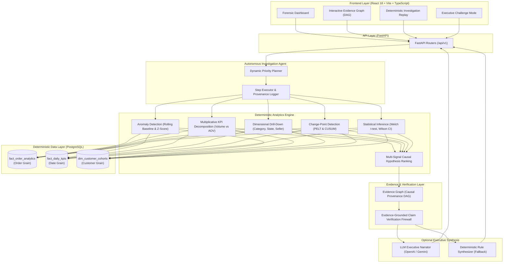

# RootCause AI

### Autonomous Business Diagnostics & Causal Hypothesis Ranking Platform

[](https://rootcause-ai-mcbj.onrender.com)
[](https://github.com/Ishita-1408/RootCause-AI/actions)
[](https://www.python.org/downloads/)
[](https://fastapi.tiangolo.com)
[](https://reactjs.org/)
[-brightgreen.svg)]()
[]()
[]()
[]()

[**🚀 Live Production Demo**](https://rootcause-ai-mcbj.onrender.com) &nbsp;|&nbsp; [**💻 GitHub Repository**](https://github.com/Ishita-1408/RootCause-AI) &nbsp;|&nbsp; [**📊 Benchmark Report**](#evaluation--benchmark)

> **Why did the KPI change?**<br>
> **What actually drove it?**<br>
> **What evidence supports the finding?**<br>
> **What should the business do next?**

RootCause AI is an autonomous business diagnostics platform that investigates business KPI anomalies, deterministically isolates contributing drivers, ranks competing causal hypotheses across multiple statistical signals, constructs an auditable Evidence Graph DAG, and produces evidence-backed operational recommendations.

**87.0% Top-1 Accuracy** &nbsp;|&nbsp; **96.5% Top-3 Accuracy** &nbsp;|&nbsp; **115 Real-Data Scenarios** &nbsp;|&nbsp; **0.0% Claim Hallucination Rate on Benchmark**

---

## Problem

Modern analytics, data science, and operational teams spend countless hours diagnosing executive questions like:
> *"Why did Gross Merchandise Value (GMV) drop 28.4% last Tuesday?"*

When organizations delegate these diagnostic investigations to generic Large Language Models (LLMs), they encounter two fundamental failure modes:
1. **Numerical Hallucination:** LLMs invent plausible-sounding percentages, ungrounded baseline comparisons, and contradictory metrics not supported by underlying transactional feature marts.
2. **Conflating Association with Causation:** LLMs routinely confuse *where* an anomaly concentrated (e.g., "São Paulo order volume fell") with *why* it occurred (e.g., "Carrier transit delays escalated +4.2 days, causing widespread SLA breaches").

---

## Solution

**RootCause AI** eliminates both failure modes through an architecture where **the LLM is NOT the source of numerical truth**.

> **Core Architectural Principle:**<br>
> The LLM is not the source of numerical truth. KPI calculations, decomposition, statistical analysis, change-point detection, causal ranking, and evidence metadata are produced by deterministic analytical components. The optional LLM layer converts verified analytical evidence into an executive-friendly narrative.

RootCause AI answers four core business questions during every investigation:
- **What changed?** (Severity, observed vs rolling 7-day baseline, percentage delta)
- **Why did it change?** (Exact multiplicative Volume vs AOV decomposition, operational indicators, segment drill-down)
- **What evidence supports the conclusion?** (Deterministic Evidence Graph linking metrics to query provenance and statistical $p$-values)
- **What should the business do next?** (Evidence-grounded, prioritized operational recommendations)

---

## Key Capabilities

- **🔍 Autonomous Multi-Step Agent:** Dynamic priority planner that traverses dimensional branches (Category, State, Seller, Logistics) without manual query authoring.
- **➗ Exact Multiplicative Decomposition:** Mathematically decomposes GMV variance into Volume, Average Order Value (AOV), and Interaction effects down to the cent.
- **📊 Statistical Inference Engine:** Validates metric shifts with two-sample Welch $t$-tests ($p < 0.05$), Wilson score intervals for operational proportions, and bootstrap confidence intervals.
- **📈 Change-Point Detection Engine:** Evaluates structural time-series regime shifts using Pruned Exact Linear Time (PELT) and Cumulative Sum (CUSUM) algorithms.
- **🧭 Multi-Signal Causal Hypothesis Ranker:** Ranks competing root-cause candidates by fusing quantitative contribution, directional consistency, metric domain relevance, statistical confidence, and temporal change-point alignment. The system ranks evidence-supported causal hypotheses from observational business data; it does not claim experimental causal identification.
- **🛡️ Evidence-Grounded Claim Verification Firewall:** Intercepts executive summary generation, parses numerical and directional statements, and verifies each claim against the analytical evidence pool before rendering.
- **🕸️ Interactive Evidence Graph (DAG):** 7-tier Directed Acyclic Graph tracing causal provenance from incident down to verified transactional data with query provenance IDs.
- **⏪ Deterministic Investigation Replay:** Immutable snapshot engine for auditing and reproducing investigations step-by-step with zero non-deterministic re-execution.
- **🥊 Executive Challenge Mode:** Counterfactual audit engine that systematically answers adversarial questions (*"Why not AOV?"*, *"What contradicts this?"*, *"Show weakest evidence"*).

---

## Investigation Workflow

```
Business Anomaly Detected
         ↓
KPI Multiplicative Decomposition (Volume vs. AOV Effects)
         ↓
Contributing-Driver & Dimensional Drill-Down (Category, State, Seller, Carrier)
         ↓
Statistical Inference & Change-Point Temporal Alignment (Welch t-test, PELT, CUSUM)
         ↓
Multi-Signal Causal Hypothesis Ranking (Contribution × Direction × Confidence)
         ↓
Evidence Graph Construction (Provenance Tracking)
         ↓
Evidence-Grounded Claim Verification (0.0% Hallucination Rate on Benchmark)
         ↓
Evidence-Backed Narrative & Actionable Recommendations
```

---

## Architecture



---

## Evidence Graph

The **Evidence Graph** provides a transparent, auditable causal DAG connecting each investigation finding:

$$\text{Incident} \longrightarrow \text{Anomaly} \longrightarrow \text{Driver Mechanism} \longrightarrow \text{Supporting Evidence} \longrightarrow \text{Affected Segment} \longrightarrow \text{Ranked Causal Hypothesis}$$

Every node contains verified mathematical metadata:
- **Observed & Baseline Values:** Exact measurements over target and rolling 7-day comparison windows.
- **Deltas & Contributions:** Quantitative volume, pricing, and dimensional contribution percentages.
- **Statistical Significance Flags:** $p$-values ($p < 0.05$), $t$-statistics, and Wilson confidence intervals.
- **Execution Provenance:** Query identifiers and timestamps linking every finding to underlying PostgreSQL analytical marts.

---

## Actionable Recommendations

Recommendations are an explicit product capability of RootCause AI. Rather than generating generic advice from an anomaly alone, **recommendations are derived from the identified mechanism and supporting evidence**:

- **Logistics & Carrier SLA Degradation:** Audit regional dispatch hubs, trigger carrier transit penalty clauses, and re-route affected fulfillment corridors to secondary delivery partners.
- **Order Volume Contraction:** Audit top affected demographic segments, inspect acquisition spend across paid channels, and evaluate checkout conversion funnel friction.
- **AOV / Basket Size Contraction:** Evaluate category promotion discounting, adjust cross-sell bundles, and review high-ticket category merchandising inventory.
- **Customer Satisfaction Decline:** Review recent delivery lead times in affected product categories, inspect merchant dispatch lead times, and audit merchant return / refund rates.

---

## Evaluation & Benchmark

RootCause AI is evaluated against an authoritative benchmark of **115 real-world business scenarios** derived from the Brazilian E-Commerce dataset (Olist).

> *The system ranks evidence-supported causal hypotheses from observational business data; it does not claim experimental causal identification. These results are measured on the defined 115-scenario benchmark and should not be interpreted as universal accuracy on unseen business datasets.*

| Metric | Measured Score | Benchmark Definition |
| :--- | :---: | :--- |
| **Scenarios Evaluated** | **115** | Authoritative real-world business scenarios from Olist data |
| **Top-1 Root-Cause Accuracy** | **87.0%** (100/115) | Primary causal mechanism correctly ranked at Rank #1 |
| **Top-3 Accuracy** | **96.5%** (111/115) | Primary causal mechanism ranked within Top-3 candidates |
| **Mean Reciprocal Rank (MRR)** | **0.9174** | Average reciprocal rank of true causal mechanism ($1/\text{rank}$) |
| **Evidence Grounding Rate** | **100.0%** | Proportion of analytical claims grounded in verified marts |
| **Claim Hallucination Rate** | **0.0%** | 0.0% claim hallucination rate on the 115-scenario benchmark |
| **Average Investigation Latency** | **719.9 ms** | End-to-end diagnostic pipeline execution time |

> *The 0.0% hallucination figure is a measured result on this benchmark, not a guarantee of zero hallucinations in arbitrary future use.*

### Performance by Scenario Difficulty

- **Easy (45 scenarios):** Top-1 = **88.9%** (40/45) &nbsp;|&nbsp; Top-3 = **97.8%** &nbsp;|&nbsp; MRR = **0.9333**
- **Medium (48 scenarios):** Top-1 = **89.6%** (43/48) &nbsp;|&nbsp; Top-3 = **97.9%** &nbsp;|&nbsp; MRR = **0.9271**
- **Hard (22 scenarios):** Top-1 = **77.3%** (17/22) &nbsp;|&nbsp; Top-3 = **90.9%** &nbsp;|&nbsp; MRR = **0.8636**

---

## Tech Stack

| Layer | Technologies |
| :--- | :--- |
| **Analytics & Engine** | Python 3.12, DuckDB, Polars, PyArrow, SciPy, Statsmodels, Scikit-Learn |
| **API & Backend** | FastAPI, Pydantic v2, Uvicorn, Psycopg 3, uv |
| **Database** | PostgreSQL (Supabase / Render) with dimensional analytics marts |
| **Frontend & UI** | React 18, TypeScript, Vite, TailwindCSS, Lucide Icons |
| **Quality & MLOps** | Pytest (269 tests), Mypy (strict), Ruff (linter & formatter), Docker |

---

## Repository Structure

```
RootCauseAI/
├── apps/
│   ├── ai/              # LLM provider abstractions & deterministic fallbacks
│   ├── analytics/       # Core analytics engine (decomposition, stats, ranker, graph)
│   ├── api/             # FastAPI routers and request schemas
│   └── web/             # React 18 frontend dashboard and visualization components
├── docs/                # Architecture specifications, limitations, and demo scripts
├── evaluation/          # Benchmark suite (115 scenarios, metrics, runner, reports)
├── scripts/             # Data ingestion and analytical mart builders
├── supabase/            # Database migrations and mart schema definitions
└── tests/               # 269 automated unit, integration, and benchmark tests
```

---

## Local Development

### 1. Prerequisites
- Python 3.12+ and [uv](https://github.com/astral-sh/uv)
- Node.js 20+ and npm
- PostgreSQL database (or local SQLite/DuckDB fallback)

### 2. Setup & Installation
```bash
# Clone repository
git clone https://github.com/Ishita-1408/RootCause-AI.git
cd RootCause-AI

# Configure environment
cp .env.example .env

# Install Python & Frontend dependencies
uv sync --all-groups
cd apps/web && npm install && cd ../..
```

### 3. Initialize Analytical Marts
```bash
uv run python scripts/ingest_olist.py
uv run python scripts/build_analytical_marts.py
```

### 4. Run Development Servers
```bash
# Terminal 1: FastAPI Backend (http://localhost:8000)
uv run uvicorn apps.api.main:app --reload --port 8000

# Terminal 2: React Frontend (http://localhost:5173)
cd apps/web && npm run dev
```

### 5. Run Tests & Quality Gates
```bash
uv run pytest -q
uv run ruff check .
uv run ruff format --check .
uv run mypy apps evaluation tests
```

---

## Deployment

RootCause AI is containerized via Docker and deployable to cloud container platforms like Render:

```bash
# Build Docker image
docker build -t rootcause-ai .

# Run Docker container
docker run -p 8000:8000 --env-file .env rootcause-ai
```

🔗 **Live Production Deployment:** [https://rootcause-ai-mcbj.onrender.com](https://rootcause-ai-mcbj.onrender.com)

---

## Limitations

- **Observational Causal Hypothesis Ranking:** The system ranks evidence-supported causal hypotheses from observational business data; it does not claim experimental causal identification.
- **Analytical Mart Ingestion:** Requires batch analytical marts (`fact_order_analytics`, `fact_daily_kpis`) rather than raw unbounded real-time message streams.
- **Demo Deployment:** The demo environment is public and intentionally unauthenticated to enable immediate benchmark and API inspection without login barriers.

---

## Documentation

- [`docs/ARCHITECTURE.md`](file:///c:/Users/Ishit/OneDrive/Desktop/RootCauseAI/docs/ARCHITECTURE.md) — System design, 7-stage investigation lifecycle, and Evidence Graph DAG.
- [`docs/LIMITATIONS.md`](file:///c:/Users/Ishit/OneDrive/Desktop/RootCauseAI/docs/LIMITATIONS.md) — Observational causal hypothesis bounds, statistical assumptions, and unauthenticated demo access model.
- [`docs/LOCAL_DEVELOPMENT.md`](file:///c:/Users/Ishit/OneDrive/Desktop/RootCauseAI/docs/LOCAL_DEVELOPMENT.md) — Setup, data ingestion, local server execution, and Docker commands.
- [`docs/DEMO_SCRIPT.md`](file:///c:/Users/Ishit/OneDrive/Desktop/RootCauseAI/docs/DEMO_SCRIPT.md) — 3-minute structured interactive demo script.
- [`evaluation/README.md`](file:///c:/Users/Ishit/OneDrive/Desktop/RootCauseAI/evaluation/README.md) — 115-scenario benchmark specification and difficulty tier breakdown.
