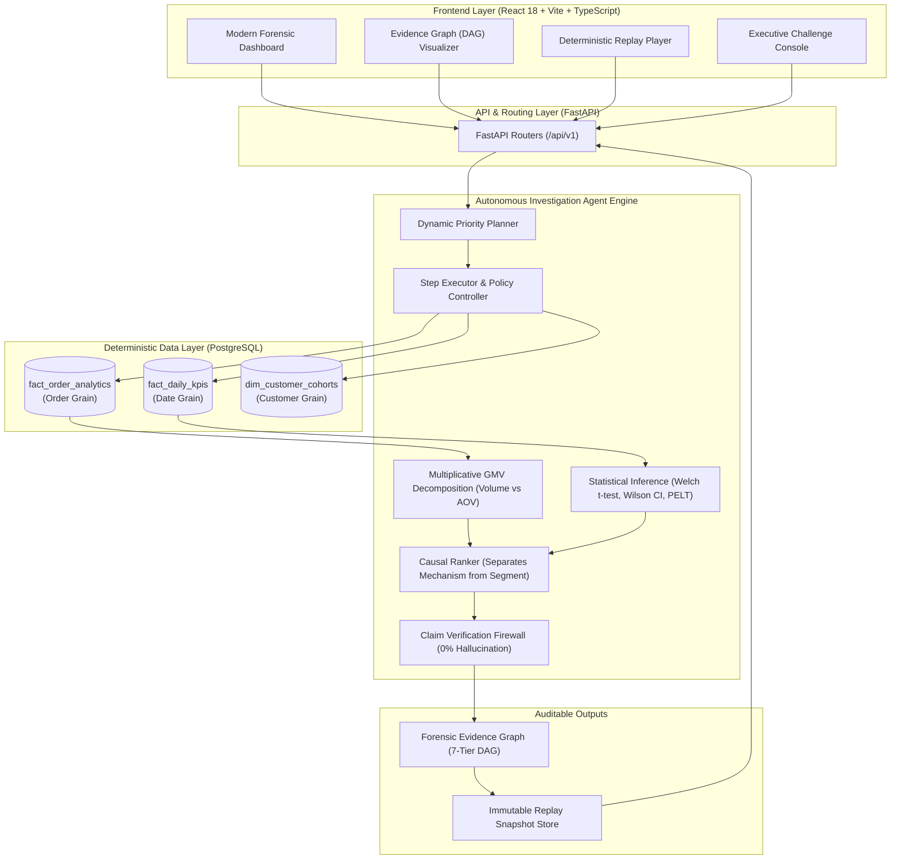

# RootCause AI — System Architecture & Design Philosophy

**RootCause AI** is an autonomous business investigation platform designed to explain *why* metrics change using verifiable analytical evidence, formal mathematical decomposition, statistical confidence intervals, and zero-hallucination language guardrails.

---

## 1. Core Architectural Principle

> [!IMPORTANT]
> **The LLM is NOT the source of numerical truth.**
> All numerical facts, time-series baselines, multiplicative decompositions, statistical tests, $p$-values, confidence intervals, and dimensional contributions are computed by **deterministic Python, SQL, and statistical components**.
> The LLM functions strictly as a natural language synthesizer operating over a verified evidence pool, constrained by an active Claim Verification Firewall.

---

## 2. End-to-End System Architecture

---

## 3. The 7-Stage Investigation Lifecycle

1. **Anomaly & Baseline Window Identification:**
   - Evaluates target date against rolling zero-lookahead baseline.
   - Computes statistical severity ($|z| \ge 2.5 \implies \text{Critical}$).

2. **Mathematical Decomposition:**
   - Multiplicatively decomposes GMV into Order Volume and Average Order Value (AOV) effects:
     $$\Delta \text{GMV} = (\Delta \text{Volume} \times \text{Base AOV}) + (\Delta \text{AOV} \times \text{Base Volume}) + (\Delta \text{Volume} \times \Delta \text{AOV})$$

3. **Statistical Confidence & Significance:**
   - Computes two-sample Welch $t$-test for continuous metric shifts:
     $$t = \frac{\bar{X}_1 - \bar{X}_2}{\sqrt{\frac{s_1^2}{n_1} + \frac{s_2^2}{n_2}}}$$
   - Computes Wilson Score intervals for operational proportions (late delivery rate, cancellation rate).

4. **Dimensional Drill-Down:**
   - Analyzes non-overlapping slices across Product Category, Customer State, Merchant Seller, and Carrier Logistics.

5. **Causal Ranking (Separating "Why" from "Where"):**
   - Distinctly separates causal mechanisms (e.g. Carrier SLA degradation) from demographic segments (e.g. State of São Paulo).

6. **Online Claim Verification Firewall:**
   - Extracts all natural language claims, parses numerical statements, and verifies them against the analytical evidence pool before rendering.

7. **Forensic DAG & Snapshot Compilation:**
   - Builds an immutable 7-tier Directed Acyclic Graph connecting incident to ranked root cause with exact query IDs.

---

## 4. Causal Evidence Hierarchy (Tiers 1–5)

RootCause AI classifies all analytical findings into a formal 5-tier causal support scale:

| Tier | Causal Classification | Definition | Permitted Language |
| :---: | :--- | :--- | :--- |
| **Tier 1** | **Descriptive Accounting** | Mathematical definitions and totals | *"Observed revenue dropped by R$ 8,890"* |
| **Tier 2** | **Statistical Association** | Empirical correlation with $p < 0.05$ | *"Associated with", "Correlated with", "Accompanied by"* |
| **Tier 3** | **Mechanistic Accounting** | Multiplicative variance decomposition | *"Explains 88.5% of variance via volume contraction"* |
| **Tier 4** | **Corroborative Signal** | Multi-source operational alignment | *"Operational logs corroborate delivery delay"* |
| **Tier 5** | **Quasi-Experimental Proof**| Counterfactual / Synthetic Control | *"Caused", "Drove" (Strictly requires experimental proof)* |

---

## 5. Security & Access Model

- **Public Demo & Evaluation:** RootCause AI exposes analytical and AI investigation services directly through a FastAPI backend. The demo deployment is intentionally unauthenticated so the system can be evaluated directly.
- **Environment Isolation:** Database credentials and optional LLM API keys are managed securely via environment variables on the backend, with zero credentials exposed to client-side frontend code.
